# raymini

A small CPU raytracer with a real-time OpenGL preview, a headless renderer and
a regression test suite.

Originally written in 2013 by Benjamin Combourieu, Alexandre Duros and Raphaël
Moutard on top of Tamy Boubekeur's raymini teaching framework (Qt +
libQGLViewer). Modernized to C++17, GLFW, OpenGL 3.3 core, Dear ImGui and stb,
with the raytracer split into a library that builds without any GL dependency.


## What it does today

- Loads OFF (colour columns and comments tolerated) and OBJ meshes. An OBJ
  may reference an MTL file: each material becomes its own object (`Kd`
  colour, `Ks` specular, `Ns` shininess); texture maps are not used yet.
  Polygons are fan-triangulated; normals come from the file or are
  recomputed. Models are stood upright on load (see Notes).
- Viewer: orbit and zoom the mesh in a GL 3.3 preview, render the same camera
  with the raytracer, save the result as PNG.
- Raytracer: ray/triangle intersection through a bounding-volume hierarchy
  per object (back faces culled; `--no-bvh` gives the brute-force reference),
  Lambert + Blinn-Phong shading with hard or soft shadows (each light a small
  disk sampled by a grid of shadow rays), an optional ground plane that
  catches them, mirror reflections (a reflectivity per material, followed
  recursively up to a depth), glass (refraction by Snell's law, split with
  reflection by the Fresnel equations), ambient occlusion (hemisphere rays that darken
  creases and contact points), n x n supersampling with
  optional jitter, and analysis modes (hit mask, normals, depth, object id,
  ambient occlusion),
  traced tile by tile on every core (`--threads n`; same pixels for any count),
  in floating-point radiance that a display maps to the screen last (metered
  exposure, a tone curve, sRGB) or that is saved as it is, in `.hdr`.
- Analytic primitives beside the meshes: a sphere, a cylinder and a disc
  given by their equation, hit at the root of a polynomial, exact at any
  zoom (`--sphere`).
  Every mode explains itself in the UI and in `--help`, with the study it
  comes from; see "Render modes" below.
- CLI: render any model to a PNG, no display needed.
- Tests: unit tests on synthetic geometry and golden-image regression on the
  teapot and ram models. CI runs them on Ubuntu and macOS.

## Step by step

The ram as each experiment of `claudedocs/EXPERIMENTS.md` lands, rendered
by today's raytracer with the matching flags (same camera, 384x256), so each
picture adds one effect to the previous one. The steps before 9 are shown as
the renderer then wrote them, linear radiance straight into bytes
(`--display linear`); from 9 on, through the default display. `scripts/render-evolution.sh`
regenerates them and the timings.

| | |
|---|---|
| 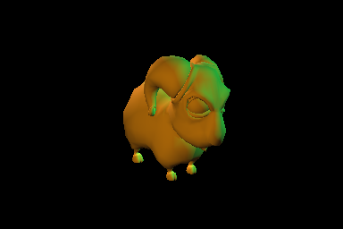<br>**Start**: Lambert + ambient, the modernized core (`--no-shadows --no-specular`). The cyan key light on the orange material gives the green tint. | 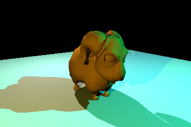<br>**1. Ground plane and hard shadows** (`--ground`): one shadow ray per light; the ram stands on a floor and casts its shadow. |
| 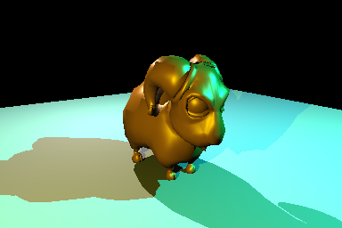<br>**2. Blinn-Phong specular**: the ram turns glossy, with highlights on the head, the horn and the back in the colour of the light that makes them. | 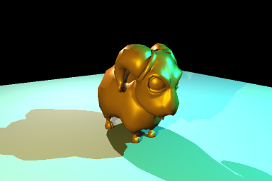<br>**5. Anti-aliasing** (`--aa 2`): 4 rays per pixel, the staircase edges smooth out. |
| <br>**6. Soft shadows** (`--shadow-samples 8`): each light a disk, 64 shadow rays; sharp at the feet, penumbra further out. | 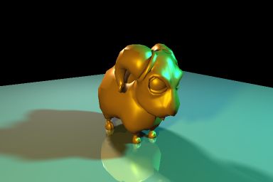<br>**7. Mirror reflections** (`--ground-reflectivity 0.4`): the ram shows upside down in the floor, which darkens where it mirrors the black sky. |
| 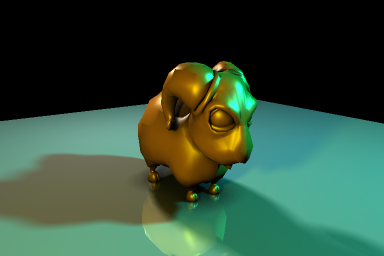<br>**8. Ambient occlusion** (`--ao 8`): 64 hemisphere rays per hit; the creases under the horn, the belly's reflection and the floor at the feet darken. | 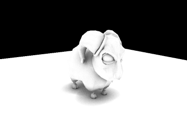<br>**8, the occlusion itself** (`--mode ao`): the open share of each point's hemisphere, white = open. |
| 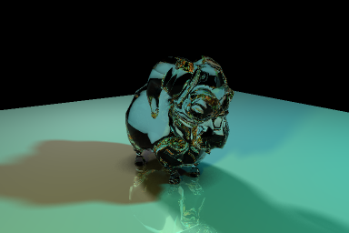<br>**7b. Refraction** (`--transparency 1`), the stretch of experiment 7, done after 8: the ram in clear glass bends the floor behind it, catches reflections at its rims and turns dark where light reflects entirely inside. | 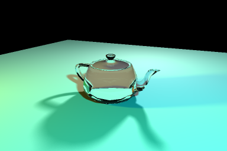<br>**7b, on the teapot**, whose smooth body reads better: the floor shows through, shifted and bent, the lid and the handle stay visible by their rims. |
| 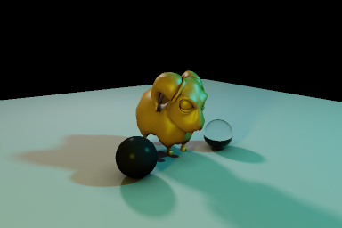<br>**11. Analytic primitives** (`--sphere`): a mirror sphere and a glass one, given by their equation, stand beside the mesh. Their silhouettes are exact circles; the mirror is dark because it reflects a black sky. | 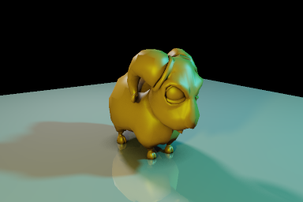<br>**9. Exposure, tone mapping, sRGB**: step 8's radiance, now metered (−1.4 EV here), through the ACES curve and encoded in sRGB, the new default. Highlights keep their gradations; the shadows open up, and the scene, lit for the old linear bytes, looks flatter. | 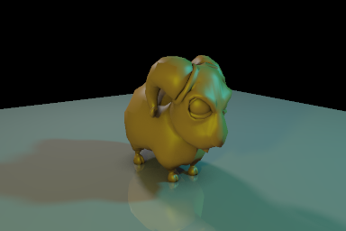<br>**9, Reinhard et al.'s photographic operator** (`--tonemap reinhard`): the same metered exposure, their curve L / (1 + L) on luminance: softer, less saturated than ACES. |

Steps 3 and 4 change the time, not the picture (the script checks the
pixels are identical). **3. BVH**: the picture of step 2 on one thread,
2.9 s brute force -> 0.018 s. **4. Tile-parallel rendering**: the picture
of step 6, 2.8 s on one thread -> 0.49 s on ten cores (4 performance + 6
efficiency). Steps 1 and 2 shipped together, and anti-aliasing (5) came
first; the gallery follows the experiment numbers, except 7b, which came
after 8 and builds on it.

## Build

Requirements: CMake 3.16+, a C++17 compiler; for the viewer, GLFW 3 and GLM.

```bash
# macOS
brew install cmake glfw glm
# Ubuntu / Debian
sudo apt-get install build-essential cmake libglfw3-dev libglm-dev libgl1-mesa-dev

cmake -S . -B build -DCMAKE_BUILD_TYPE=Release
cmake --build build -j
```

`-DRAYMINI_BUILD_GUI=OFF` skips the viewer (no GLFW/GLM needed);
`-DRAYMINI_BUILD_TESTS=OFF` skips the tests. Executables are written to `build/`.

Ready-made builds for macOS and Linux are attached to every
[release](https://github.com/alexduros/RayTracer/releases), one per step of
the timeline, with the changelog section as its notes. `raymini-cli` in the
archive needs nothing installed; the viewer needs GLFW and GLM.
`scripts/package.sh build dist` builds the same archive locally.

## Run

```bash
build/raymini [models/minion.off]                     # viewer (model optional)
build/raymini-cli teapot --mode normals --size 512x512 --yaw 25 --pitch 20
build/raymini-cli cube --mode lit --yaw 25 --pitch 20  # OBJ + MTL sample
build/raymini-cli ram --ground --aa 2 --yaw -35 --pitch 15   # floor + shadows, the Rendu.png look
build/raymini-cli ram --ground --aa 2 --shadow-samples 8 --yaw -35 --pitch 15   # the same, soft shadows
build/raymini-cli ram --ground-reflectivity 0.4 --aa 2 --yaw -35 --pitch 15     # on a mirror floor
build/raymini-cli ram --ground --ao 8 --aa 2 --yaw -35 --pitch 15               # ambient occlusion
build/raymini-cli ram --ground --mode ao --yaw -35 --pitch 15                   # the occlusion alone
build/raymini-cli teapot --ground --transparency 1 --aa 2 --yaw 25 --pitch 20   # a glass teapot
build/raymini-cli ram --ground --tonemap reinhard --exposure +0.5                 # another curve, half a stop over
build/raymini-cli ram --ground --display linear                                   # the look before experiment 9
build/raymini-cli ram --ground --out renders/ram.hdr                              # radiance, no display (RGBE)
build/raymini-cli ram --ground --ambient 0.05 --light 0 3 3 3 1 1 1 1 --color 0.9 0.9 0.95   # retune rig and material
build/raymini-cli ram --ground --aa 2 --yaw -35 --pitch 15 \
    --sphere -1.05 -0.62 0.45 0.38 mirror --sphere 1.15 -0.66 0.3 0.34 glass   # analytic spheres
build/raymini-cli teapot --up +y                       # override the file's up axis (auto: orientation.txt)
build/raymini-cli --help                              # all options
```

The CLI writes `renders/<model>_<mode>.png` by default; bare model names
resolve to `models/`.

Viewer controls:

- The layout follows the window: resize it or go full screen and the panels
  and the preview scale with it (the preview is re-rendered at the displayed
  size, so it stays sharp).
- Controls panel, four sections: Model (picker over every `.off` and `.obj`
  in `models/`, up axis, ground plane and how much it mirrors, the model's
  own mirror share, glass share and index, the number of bounces, mesh
  stats), Camera (FOV, position, target, Reset), Preview
  (wireframe, back-face culling), Render (output width, mode: Lit, Ambient,
  Hit mask, Normals, Depth, Object id, Ambient occlusion; anti-aliasing and
  jitter; shadows, specular, soft shadows and light size; occlusion and its
  radius; threads; depth range in Depth mode).
- Left-drag in the preview to orbit, scroll to zoom.
- Raytracer panel: Render Scene traces on worker threads (one per core by
  default, Threads in Render), so the UI stays live while the image fills in
  tile by tile behind a progress bar; Cancel stops it. Then Save PNG or Save
  HDR (into `renders/`), timing and hit ratio. Below, the display: Auto
  exposure, an exposure in stops (a correction over the metered one when
  Auto is on), the tone curve and sRGB; changing them re-maps the last
  render at once, without tracing again. Starts on the teapot unless a path
  is given on the command line.

## Render modes

The same text is shown under the render in the viewer and printed by
`raymini-cli --help`; it lives in `RayTracer::info()`.

| Mode | What it computes | How to read it | Study |
|------|------------------|----------------|-------|
| **Lit (Lambert + Blinn-Phong, shadows)** | Per light: material colour × light colour × max(0, n·l) (Lambert), a white highlight where the half-vector between light and view aligns with the normal, raised to the shininess (Blinn-Phong), both scaled by the fraction of the light that shadow rays find unblocked (one ray: all or nothing; soft shadows: a grid over the light's disk); plus a constant ambient term. With ambient occlusion on, the ambient and diffuse terms are scaled by how open the surroundings are. On a reflective material, blended with what the mirrored ray sees; on a transparent one, with what the glass reflects and lets through. | Brighter where a surface faces a light; tight bright spots are highlights; blocked lights leave only the ambient term, and with soft shadows the edge fades across a penumbra. Colour is material × light, so the cyan key light tints the orange default material green. Turn on the ground plane to see shadows fall, and give it some reflectivity to see the model mirrored in it. | J. H. Lambert, *Photometria* (1760); J. Blinn, "Models of Light Reflection for Computer Synthesized Pictures", SIGGRAPH 1977; shadow rays: A. Appel, AFIPS 1968, T. Whitted, CACM 23(6), 1980 |
| **Ambient (albedo)** | The material's base colour (Kd) at the hit, unlit. | Flat silhouettes per material; checks materials and outlines, shows no shape. | Ambient term of B. T. Phong, "Illumination for Computer Generated Pictures", CACM 18(6), 1975 |
| **Hit mask (coverage)** | White where the primary ray hits geometry, black where it escapes. | A binary silhouette; with anti-aliasing, edge pixels turn grey in proportion to coverage. | T. Porter & T. Duff, "Compositing Digital Images", SIGGRAPH 1984 |
| **Normals** | Surface normal remapped from [-1, 1] to [0, 1]: x→red, y→green, z→blue. | A face pointing at the camera is light violet, one pointing up light green; flat patches are hard edges. | Normal-map encoding: Cohen, Olano & Manocha, "Appearance-Preserving Simplification", SIGGRAPH 1998; Blinn, "Simulation of Wrinkled Surfaces", SIGGRAPH 1978 |
| **Depth** | Eye-to-hit distance mapped between near and far: white at near, dark grey at far, black = nothing hit. | Brighter is closer; tighten near/far around the model if it is all one shade. | The z-buffer: E. Catmull, PhD thesis, University of Utah, 1974 |
| **Object id** | One palette colour per object (per material group for OBJ). | Same colour = same object; a one-colour OFF model is expected. | The item buffer: Weghorst, Hooper & Greenberg, "Improved Computational Methods for Ray Tracing", ACM TOG 3(1), 1984 |
| **Ambient occlusion** | n × n rays over the hemisphere around the normal, cosine-weighted; the share that meets nothing within the radius, as grey. In Lit mode the same share scales the ambient and diffuse terms. | White is open, darker is enclosed: creases, the inside of the horns, the floor around the feet. A small radius darkens only contact points, a large one whole cavities; few samples leave grain. | Zhukov, Iones & Kronin, "An Ambient Light Illumination Model", Eurographics Rendering Workshop 1998; Malley's method on Shirley & Chiu's concentric map |

**Anti-aliasing** (`--aa n`, `--jitter`; Anti-alias / Jitter in the viewer):
n × n primary rays per pixel averaged in linear colour. Jitter offsets each
ray inside its cell with a per-pixel seed, so renders stay reproducible and
independent of tile order. One ray per pixel gives staircase edges; 2x2 or
3x3 smooths them at 4x or 9x the cost. Whitted, "An Improved Illumination
Model for Shaded Display", CACM 23(6), 1980; Cook, "Stochastic Sampling in
Computer Graphics", ACM TOG 5(1), 1986.

**Soft shadows** (`--shadow-samples n`, `--light-radius f`; Soft shadows /
Light size in the viewer): each light is a disk of f × the model's size (0.1
by default), and n × n shadow rays over it, one jittered ray per cell of a
grid mapped onto the disk, measure the fraction of the light a point sees.
Shadows gain a penumbra, wider for bigger lights and for occluders far from
the surface, while contact shadows stay sharp; each light costs n × n shadow
rays per shaded point. Cook, Porter & Carpenter, "Distributed Ray Tracing",
SIGGRAPH 1984; Shirley & Chiu, "A Low Distortion Map Between Disk and
Square", Journal of Graphics Tools 2(3), 1997.

**Ambient occlusion** (`--ao n`, `--ao-radius f`; Occlusion / AO radius in
the viewer, and the Ambient occlusion mode): n × n rays per hit over the
hemisphere, one jittered ray per cell of a grid on the unit disk lifted onto
the hemisphere (so they follow the cosine), each blocked if it meets a
surface within f × the model's size (0.2 by default). The open share scales
the ambient and diffuse light, not the highlight: an approximation that
helps shapes read, where the 2013 version darkened the whole colour. Off by
default; `--mode ao` alone takes 8 × 8. Each hit costs n × n extra rays:
the ram on its ground at 384x256 takes 0.02 s without, 0.24 s with 8 × 8 on
one thread. Coarse meshes with smooth normals show a few grey specks, where
rays leave below the true face.

**Analytic primitives** (`--sphere x y z r matte|mirror|glass`, repeatable;
`src/core/Primitive.h`): a sphere, a cylinder or a disc is an equation, not a
tessellation. The ray meets it where a polynomial vanishes, so one root
replaces thousands of triangle tests and the silhouette stays a perfect
circle however close the camera gets — a tessellated sphere only converges
to it, by the sagitta of its facets. Positions and radii are given in half
model sizes around the model's centre, like `--light`. Primitives sit in the
scene next to the meshes, cast and receive shadows, reflect and refract.
Goldstein & Nagel, "3-D Visual Simulation", *Simulation* 16(1), 1971, where
solids were quadrics combined by boolean operators; Roth, "Ray Casting for
Modeling Solids", CGIP 18(2), 1982.

**Exposure, tone mapping and encoding** (`--display filmic|linear`,
`--exposure`, `--auto-exposure`, `--tonemap none|reinhard|aces`, `--white`,
`--gamma srgb|g`; the display row of the Raytracer panel): the tracer
computes linear radiance in floats, above 1 wherever lights add up, and the
display maps it to the screen last. The default, `filmic`, meters the
exposure that brings the log-average luminance to mid grey (0.18, Reinhard
et al.'s key), applies the ACES filmic curve and encodes in sRGB; `linear` is
the conversion of every render before experiment 9, and of the goldens
(radiance × 255, clipped). Without a curve everything above 1 is one flat
white; Reinhard's L (1 + L / L_white²) / (1 + L) on luminance keeps the hue
and compresses gently, ACES adds a filmic toe and more contrast. `.hdr`
output keeps the radiance itself (Ward's RGBE). Reinhard, Stark, Shirley &
Ferwerda, "Photographic Tone Reproduction for Digital Images", SIGGRAPH 2002;
Narkowicz, "ACES Filmic Tone Mapping Curve", 2015; Ward, "Real Pixels",
Graphics Gems II, 1991.

**Refraction (glass)** (`--transparency g`, `--ior n`, `--max-depth n`;
Glass and Index in the viewer; MTL `d`, `Tr` and `Ni`): on a material of
transparency g the surface is clear glass. The Fresnel equations split the
light between the mirrored ray (about 4 % head-on for glass, all of it at
grazing angles) and a ray bent by Snell's law, n1 sin i = n2 sin t; inside
the object that ray also meets the back of the surface, and leaves the same
way or reflects entirely past the critical angle. The colour is (1 - g) ×
the surface's own shading + g × (F × reflected + (1 - F) × refracted). What
lies behind shows through, shifted and bent; rims catch reflections. The
glass is uncoloured and its shadow opaque (light focused through it is not
traced). Each glass hit splits a ray in two, so bounces cost: the ram in
glass at 384x256 takes 0.07 s at depth 4, 0.2 s at 8 (the default, which
leaves few paths cut short) and 1 s at 16 on one thread. Whitted, CACM
23(6), 1980; the Fresnel equations, Born & Wolf, *Principles of Optics*,
section 1.5.

**Mirror reflections** (`--reflectivity k` for the model,
`--ground-reflectivity k` for the ground, `--max-depth n`; Ground mirror,
Mirror and Bounces in the viewer): on a material of reflectivity k a second
ray leaves the hit point mirrored about the normal, and the colour becomes
(1 - k) × the surface's own shading + k × what that ray sees, shaded the
same way up to n reflections (8 by default; at the limit a surface keeps its
own shading, so 0 turns reflections off). A mirror floor shows the model
upside down; facing mirrors repeat each other, each copy fainter by k; where
the ray escapes, the surface darkens toward the background. Mirrors are
perfect (sharp, uncoloured), so a point light's highlight fades with k.
Whitted, "An Improved Illumination Model for Shaded Display", CACM 23(6),
1980.

## Test

```bash
ctest --test-dir build --output-on-failure
build/raymini_tests --filter camera                    # a subset
build/raymini_tests --filter golden --update-golden    # after an intentional rendering change
```

Golden images live in `tests/golden/`; review their diff before committing a
regeneration.

## Layout

```
CMakeLists.txt          root project; options RAYMINI_BUILD_GUI / RAYMINI_BUILD_TESTS
src/core/               raymini_core: mesh, ray, bvh, camera, scene, raytracer, image
src/gui/Main.cpp        raymini (GLFW + Dear ImGui viewer)
src/cli/Main.cpp        raymini-cli (headless renderer)
tests/                  raymini_tests + tests/golden/*.png
third_party/            imgui, glad, stb
scripts/                render-evolution.sh, which renders docs/evolution/
docs/evolution/         the README's pictures, one per experiment
models/                 OFF models (teapot, ram, minion, dragon, ...), cube.obj/.mtl, orientation.txt
claudedocs/             EXPERIMENTS.md (next steps), MODERNIZATION_ROADMAP.md
.github/workflows/      CI: build + tests + sample renders on Ubuntu and macOS
```

## Next steps

`claudedocs/RENDERING_ROADMAP.md` maps the rendering modes the raytracer can
offer next (shading, light transport, textures, camera effects, analysis
modes, and what complex scenes need), each with a one-sentence principle;
the viewer lists them greyed out under "Planned" in the mode menu and
`raymini-cli --help` prints them. `claudedocs/EXPERIMENTS.md` is the
implementation order, each step with the test that proves it.

## Notes

- The scene is Y-up, but model files follow no convention (the teapot and
  the ram are Z-up, the minion Y-up). Each model is rotated on load so its
  own up axis becomes +Y: `models/orientation.txt` lists the axis for every
  bundled model, files not listed get a heuristic (the flattest side of the
  bounding box is the bottom), and the viewer's "Up axis" menu or
  `raymini-cli --up` overrides both. Add a line to `orientation.txt` next to
  your own models to make them load upright.
- The default lights are the original project's cyan / yellow / white rig,
  scaled to the model and kept above its base.
