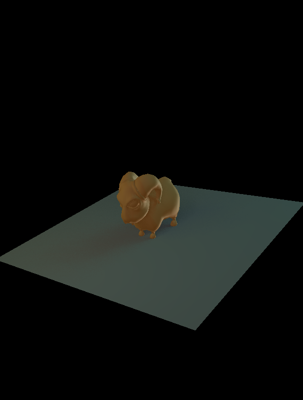

# raymini

A small CPU raytracer with a real-time OpenGL preview, a headless renderer and
a regression test suite.

Originally written in 2013 by Benjamin Combourieu, Alexandre Duros and Raphaël
Moutard on top of Tamy Boubekeur's raymini teaching framework (Qt +
libQGLViewer). Modernized to C++17, GLFW, OpenGL 3.3 core, Dear ImGui and stb,
with the raytracer split into a library that builds without any GL dependency.



## What it does today

- Loads OFF and OBJ meshes. An OBJ may reference an MTL file: each material
  becomes its own object (`Kd` colour, `Ks` specular); texture maps are not
  used yet. Polygons are fan-triangulated; normals come from the file or are
  recomputed.
- Viewer: orbit and zoom the mesh in a GL 3.3 preview, render the same camera
  with the raytracer, save the result as PNG.
- Raytracer: ray/triangle intersection (brute force, back faces culled),
  Lambert shading with point lights, and debug modes: hit mask, normals,
  depth, object id.
- CLI: render any model to a PNG, no display needed.
- Tests: unit tests on synthetic geometry and golden-image regression on the
  teapot and ram models. CI runs them on Ubuntu and macOS.

## Build

Requirements: CMake 3.16+, a C++17 compiler; for the viewer, GLFW 3 and GLM.

```bash
# macOS
brew install cmake glfw glm
# Ubuntu / Debian
sudo apt-get install build-essential cmake libglfw3-dev libglm-dev libgl1-mesa-dev

cmake -S . -B build -DCMAKE_BUILD_TYPE=Release
cmake --build build -j
```

`-DRAYMINI_BUILD_GUI=OFF` skips the viewer (no GLFW/GLM needed);
`-DRAYMINI_BUILD_TESTS=OFF` skips the tests. Executables are written to `build/`.

## Run

```bash
build/raymini [models/minion.off]                     # viewer (model optional)
build/raymini-cli teapot --mode normals --size 512x512 --yaw 25 --pitch 20
build/raymini-cli cube --mode lit --yaw 25 --pitch 20  # OBJ + MTL sample
build/raymini-cli --help                              # all options
```

The CLI writes `renders/<model>_<mode>.png` by default; bare model names
resolve to `models/`.

Viewer controls:

- Controls panel, four sections: Model (picker over every `.off` in
  `models/`, mesh stats), Camera (FOV, position, target, Reset), Preview
  (wireframe, back-face culling), Render (output width, mode: Lit, Ambient,
  Hit mask, Normals, Depth, Object id; depth range in Depth mode).
- Left-drag in the preview to orbit, scroll to zoom.
- Raytracer panel: Render Scene, Save PNG (into `renders/`), timing and hit
  ratio, then the image. Starts on the teapot unless a path is given on the
  command line.

## Test

```bash
ctest --test-dir build --output-on-failure
build/raymini_tests --filter camera                    # a subset
build/raymini_tests --filter golden --update-golden    # after an intentional rendering change
```

Golden images live in `tests/golden/`; review their diff before committing a
regeneration.

## Layout

```
CMakeLists.txt          root project; options RAYMINI_BUILD_GUI / RAYMINI_BUILD_TESTS
src/core/               raymini_core: mesh, ray, camera, scene, raytracer, image
src/gui/Main.cpp        raymini (GLFW + Dear ImGui viewer)
src/cli/Main.cpp        raymini-cli (headless renderer)
tests/                  raymini_tests + tests/golden/*.png
third_party/            imgui, glad, stb
models/                 OFF models (teapot, ram, minion, dragon, ...) and cube.obj/.mtl
claudedocs/             EXPERIMENTS.md (next steps), MODERNIZATION_ROADMAP.md
.github/workflows/      CI: build + tests + sample renders on Ubuntu and macOS
```

## Next steps

`claudedocs/EXPERIMENTS.md` lists the next ten experiments (ground plane and
hard shadows, Blinn-Phong, BVH, threads, anti-aliasing, soft shadows,
reflections, ambient occlusion, tone mapping, depth of field), each with the
test that proves it.

## Notes

- Some OFF files are Z-up (the teapot); the viewer and CLI assume Y-up.
- The default lights are the original project's cyan / yellow / white rig,
  scaled to the model.
